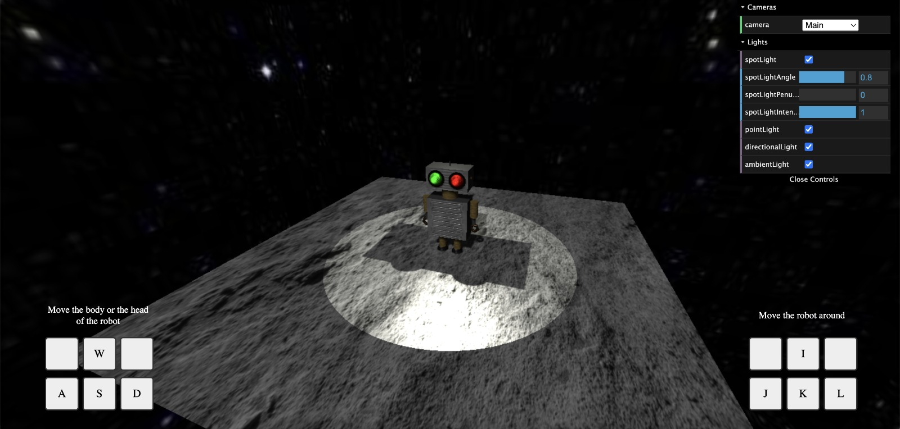

# Practica 3

Escuela de Ingeniería Informática - Universidad de Valladolid  
Profesora: Margarita Gonzalo Tasis   
Asignatura: Programación de Aplicaciones Gráficas 
Alumno: Matheus Vieira Santos 
Curso 2023/2024 

## Descripción
La Práctica 3 de Programación de Aplicaciones Gráficas consiste en desarrollar una página web que presente un modelo 3D de un robot utilizando ThreeJs. Se requiere la implementación de texturas, luces y materiales, así como la interacción mediante eventos. La figura del robot debe ser una composición de objetos 2D y 3D, con una cabeza que incluya elementos representativos de cámaras. Se deben usar al menos dos texturas 2D distintas y materiales diversos para interactuar con la luz.

## [ENLACE PARA PÁGINA WEB CON PROYECTO](http://virtual.lab.inf.uva.es:23172/practica3/)

## Bibliotecas utilizadas en el proyecto

### Three JS
Three.js es una biblioteca de JavaScript que simplifica la creación de gráficos en 3D para aplicaciones web. Facilita la construcción de experiencias interactivas y visualmente atractivas al proporcionar una abstracción sobre WebGL, permitiendo a los desarrolladores trabajar con gráficos 3D de manera más accesible. Con Three.js, se pueden crear modelos, aplicar texturas, luces y materiales con relativa facilidad. Además, ofrece funcionalidades para manejar eventos y manipular la cámara para una experiencia de usuario envolvente. Un módulo incluido en Three.js, llamado Orbit Controls, proporciona una manera conveniente de controlar la cámara en una escena 3D, permitiendo la interacción del usuario mediante acciones como arrastrar el mouse para rotar, hacer zoom y pan (mover) la cámara. Para explorar más sobre Three.js y sus características, puedes visitar su [sitio oficial](https://threejs.org/).

### Dat.GUI
Dat.GUI es una biblioteca de interfaz de usuario liviana para la creación de controles interactivos en aplicaciones web. Diseñada para facilitar la manipulación de parámetros y configuraciones, Dat.GUI permite la creación rápida de interfaces intuitivas para ajustar valores en tiempo real. Esta herramienta es particularmente útil en entornos de desarrollo web relacionados con gráficos y visualizaciones, donde se pueden controlar variables y opciones de manera fácil y visual. Su integración es sencilla, y su diseño minimalista proporciona una experiencia de usuario limpia. Para obtener más información y comenzar a incorporar Dat.GUI en tus proyectos, puedes explorar la [documentación oficial](https://github.com/dataarts/dat.gui/blob/master/API.md).

